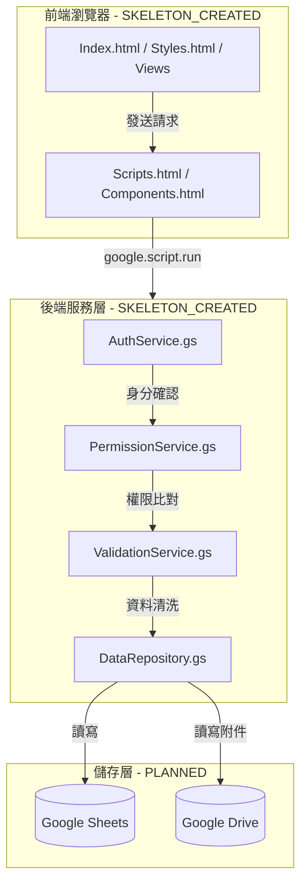
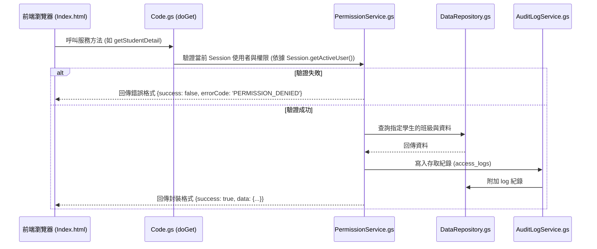
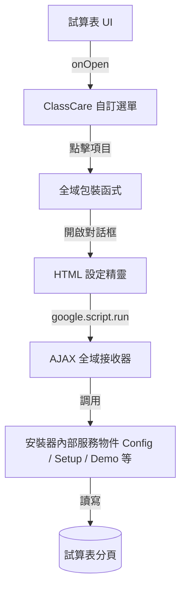

# ClassCare 班級關懷工作台 — 系統架構設計

本系統為基於 **Google Apps Script (GAS) Web App** 的輕量級 CRM，無外部伺服器依賴，所有敏感資料均儲存於 Google Sheets 中。

---

## 1. 系統分層架構 (System Layering)

> [!NOTE]
> **當前狀態**：
> *   架構規劃與規範文件：`DOCUMENTED` (已編寫文件)
> *   後端唯讀服務與安裝器：`IMPLEMENTED` (服務層與脫敏驗證已實作，前端頁面仍為骨架，尚未在 GAS 真實環境驗證)



*   **前端層**：採用單網頁 (SPA) 設計，由 `Index.html` 作為主要載體，藉由 `<template>` 動態切換畫面。與後端的通信僅使用 `google.script.run` 非同步呼叫。（狀態：`SKELETON_CREATED`）
*   **安全與權限層 (`AuthService`, `PermissionService`)**：在任何資料讀取或寫入之前，必須經由後端抓取 `Session.getActiveUser().getEmail()` 與資料庫的 `users` 角色進行比對。
*   **資料存取層 (`DataRepository`)**：封裝所有與試算表的直接互動。其他服務（如 `StudentService`）不得直接操作 `SpreadsheetApp`，以確保寫入鎖定 (`LockService`) 與欄位對齊機制正確運行。（狀態：`SKELETON_CREATED`）

---

## 2. 命名空間物件設計 (Namespace Object Pattern)
為防止 Google Apps Script 將所有檔案內宣告的函式全數扁平化至全域命名空間，導致函式名稱衝突或覆蓋，所有 `.gs` 服務必須封裝於**命名空間物件**中：

```javascript
// 範例：AuthService.gs
const AuthService = {
  getActiveUserEmail: function() {
    const email = Session.getActiveUser().getEmail();
    if (!email) {
      throw new Error("Unauthorized: Session email is missing.");
    }
    return email;
  },

  getUserSessionInfo: function() {
    const email = this.getActiveUserEmail();
    return UserService.getUserByEmail(email);
  }
};
```
*   **例外項目**：僅 `Code.gs` 中的 Web App 進入點（如 `doGet()`, `doPost()`）以及可直接在編輯器中執行的手動觸發器（如 `SetupService.setupSystem()`、`SetupService.seedDemoData()`、`TestRunner.runAllTests()`）可宣告為全域函式。

---

## 3. API 請求與驗證序列圖 (API Request Flow)



---

## 4. 核心架構與身份識別決策
*   **無 Web App 公開存取**：Web App 部署權限限於「您的機構內成員」或指定使用者，防範公開洩漏。
*   **身份識別之根**：所有使用者認證及權限判斷一律以 **`Session.getActiveUser().getEmail()`** 為根。前端傳入的任何 `user_email` 參數只做為一般關聯對齊比對（如防篡改），絕不作為授權宣告之依據。
*   **防併發寫入**：在寫入任何資料（如新增親師聯絡紀錄）時，使用 `LockService.getScriptLock()` 來避免資料表同時更新造成損毀。

---

## 5. 單檔安裝版架構 (Single-File Installer Architecture)
為提供非開發者簡易的一鍵部署體驗，專案於 `dist/ClassCareInstaller.gs` 分發單檔案安裝程式：



*   **單檔案限制解決**：藉由 JavaScript 常數將 HTML 樣式與控制碼（如 `SetupWizardHtml`）以字串形式儲存，在執行期透過 `HtmlService.createHtmlOutput(string)` 動態生成。
*   **選單全域映射**：Apps Script 選單只能連結全域函式。因此單檔版定義了對應的全域包裝函式（如 `showSetupWizard()`, `showAdminSetupDialog()`），內部再轉調用封裝之 Namespace 服務。
*   **AJAX 前後端互動**：同樣地，由於 `google.script.run` 僅能呼叫全域方法，我們建立了以 `ajax` 作為前綴的全域對接函式（如 `ajaxRunSetup()`），以做為前後端資料流的安全管道。

---

## 6. 匯入中心與名冊匯入 MVP 設計 (Import Center & Roster Import MVP)
為支援大量學生名冊與行政指派，系統於 Phase C1 實作基於 Google Sheet `import_students` 工作表之名冊匯入流程：

### 6.1 暫存工作表與匯入程序
1.  **建立範本**：點選選單建立範本時，系統會建立 `import_students` 暫存工作表，寫入標頭列：`school_year`, `class_name`, `grade`, `seat_no`, `student_name`, `student_number`, `status`, `teacher_email`。
2.  **資料預檢 (Dry-Run Preview)**：
    *   直接讀取 `import_students` 中已編輯之資料。
    *   於後端進行嚴格的格式、重複性與關聯性預檢，包含批次內部及與資料庫中既有紀錄之比對。
    *   計算並回傳：`totalRows`, `validRows`, `warningRows`, `errorRows`, `newClasses`, `existingClasses`, `newStudents`, `updatedStudents`, `newTeachers`, `newScopes`。
    *   **限制**：預檢階段絕不寫入正式工作表。
3.  **正式寫入 (Commit)**：
    *   呼叫 `importStudentRoster()`，利用 `LockService.getScriptLock()` 保護。
    *   依序建立或取得班級、使用者、導師 CLASS scopes、學生與 mappings。
    *   若某一列匯入失敗，將該列錯誤原因寫入 `import_errors`，其餘正常列繼續處理，確保批次不因單一錯誤而靜默失敗。

### 6.2 學生身份識別機制 (Student Matching Priority)
系統防範重複資料，依序採行以下優先順序：
1.  **學年度 + 學號 (school_year + student_number)**：核對 `import_student_mapping`，匹配成功即更新既有學生，並保留 `student_id`。
2.  **學年度 + 班級名稱 + 座號 (school_year + class_name + seat_no)**：匹配成功即更新既有學生並保留其系統 `student_id`。
3.  **學年度 + 班級名稱 + 姓名 (school_year + class_name + student_name)**：僅作為警告比對項目（`只靠姓名找到疑似學生`），不自動更新與匹配既有學生，以防資料重疊覆蓋。

### 6.3 導師授權與工作台串接
*   **指派導師與 Scopes**：當資料列帶有 `teacher_email` 時，系統會自動在 `users` 建立或啟用 `CLASS_TEACHER` 使用者，並在 `user_scopes` 為其新增以 `class_id`（非班級名稱）為 `scope_value` 的 `CLASS` 範疇，起迄日期空白（立即且永久有效）。
*   **非自動指派目前登入者**：系統絕不自動指派當前登入者為所有匯入班級的導師，除非匯入資料中指定了其 Email。
*   **導師工作台讀取驗證**：匯入結束後，系統會自動判定目前登入者是否已取得所匯入班級之權限，若無，則在成功對話框中顯示明確提示，且不得在未授權下自動放行，確保工作台權限模型依然保持「身份認證之根」的最高標準。
